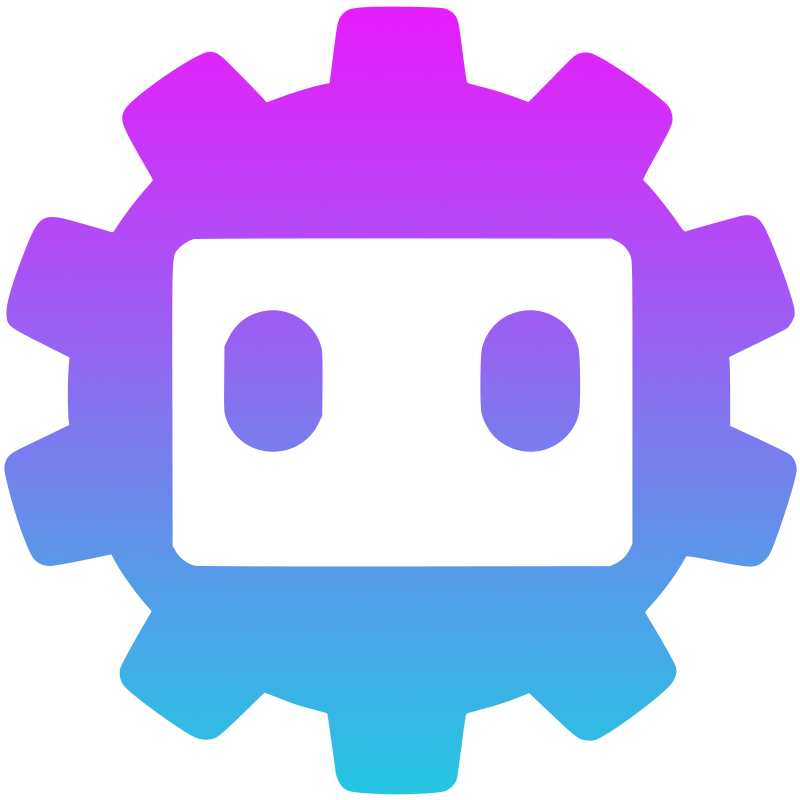

# GDBLive - B站直播开放平台 Godot 插件

<div align="center">



**为 Godot 4 打造的 B站直播开放平台插件**

让你的 Godot 游戏轻松接入 B站直播互动功能

[](https://godotengine.org/)
[](LICENSE)

</div>

---

## 📖 这是什么？

GDBLive 是一个 Godot 4 插件，让你可以在游戏中接收 B站直播间的实时互动消息

### 可以用来做什么？

- 🎮 **直播互动游戏** - 观众通过弹幕控制游戏角色
- 📊 **数据可视化** - 实时展示礼物、SC 等数据
- 🎪 **直播间小游戏** - 抽奖、投票、答题等
- 🤖 **互动机器人** - 自动回复、数据统计等

---

## 🚀 快速开始

### 第一步：安装插件

1. 从 [Releases](https://github.com/GDBlive) 下载最新版本
2. 解压到你的 Godot 项目的 `addons/` 目录
3. 在 Godot 编辑器中启用插件：`项目 → 项目设置 → 插件 → GDBLive`

### 第二步：获取 API 凭证

1. 访问 [B站直播开放平台](https://open-live.bilibili.com/)
2. 注册并创建应用
3. 获取以下信息：
   - **身份码**（code）
   - **应用ID**（app_id）
   - **密钥ID**（access_key_id）
   - **密钥**（access_key_secret）

### 第三步：编写代码

创建一个脚本，复制以下代码：

```gdscript
extends Node

# 创建Blive节点
@onready var blive = $Blive

func _ready():
    
    # 连接信号
    blive.start_completed.connect(_on_start_completed)
    blive.ws_message_received.connect(_on_ws_message_received)
    
    # 开启项目
    blive.start()

# 项目开启成功后，连接 WebSocket
func _on_start_completed(response_json: String):
    var json = JSON.new()
    json.parse(response_json)
    var data = json.data
    
    if data["code"] == 0:
        # 保存场次ID
        game_id = data["data"]["game_info"]["game_id"]
        
        # 获取 WebSocket 信息
        var ws_info = data["data"]["websocket_info"]
        var ws_url = ws_info["wss_link"][0]
        var auth_body = ws_info["auth_body"]
        
        # 连接 WebSocket（会自动维持ws心跳）
        blive.start_websocket(ws_url, auth_body)
        
        # 启动App心跳（保持连接）
        blive.start_heartbeat(game_id)
        
        print("✓ 连接成功！等待接收消息...")

# 收到消息时触发
func _on_ws_message_received(cmd: String, data_json: String):
    var json = JSON.new()
    json.parse(data_json)
    var msg_data = json.data
    
    # 处理弹幕
    if cmd == "LIVE_OPEN_PLATFORM_DM":
        var dm = msg_data["data"]
        var username = dm["uname"]
        var message = dm["msg"]
        print("💬 ", username, " 说：", message)
    
    # 处理礼物
    elif cmd == "LIVE_OPEN_PLATFORM_SEND_GIFT":
        var gift = msg_data["data"]
        var username = gift["uname"]
        var gift_name = gift["gift_name"]
        var gift_num = gift["gift_num"]
        print("🎁 ", username, " 送了 ", gift_num, " 个", gift_name)
    
    # 处理 SC
    elif cmd == "LIVE_OPEN_PLATFORM_SUPER_CHAT":
        var sc = msg_data["data"]
        var username = sc["uname"]
        var message = sc["message"]
        var price = sc["rmb"]
        print("💰 ", username, " 发送了 ¥", price, " 的 SC：", message)

# 退出时清理资源
func _exit_tree():
    if blive:
        blive.stop_websocket()
        blive.stop_heartbeat()
        if game_id != "":
            blive.end(game_id)
```

### 第四步：运行测试

1. 运行你的 Godot 项目
2. 在你的直播间发送弹幕
3. 查看 Godot 控制台，应该能看到弹幕消息

---

## 📚 API 参考

### 配置属性

```gdscript
blive.code = "你的身份码"
blive.app_id = "你的应用ID"
blive.access_key_id = "你的密钥ID"
blive.access_key_secret = "你的密钥"
```

### 常用方法

#### 开启项目
```gdscript
blive.start()
```
调用后会触发 `start_completed` 信号，返回场次信息和 WebSocket 连接信息。

#### 关闭项目
```gdscript
blive.end(game_id)
```

#### 连接 WebSocket
```gdscript
blive.start_websocket(ws_url, auth_body)
```
从 `start_completed` 信号中获取 `ws_url` 和 `auth_body`。

#### 断开 WebSocket
```gdscript
blive.stop_websocket()
```

#### 启动心跳
```gdscript
blive.start_heartbeat(game_id)
```
每 20 秒自动发送一次心跳，保持连接。

#### 停止心跳
```gdscript
blive.stop_heartbeat()
```

### 信号

#### start_completed(response_json: String)
项目开启完成时触发。

**响应数据结构：**
```json
{
  "code": 0,
  "message": "ok",
  "data": {
    //  场次信息
    "game_info": {
      //  场次id,心跳key(推荐心跳保持20s)调用一次,互动玩法超过60秒，H5插件和工具超过180s无心跳自动关闭,长连停止推送消息
      "game_id": ""
    },
    //  长连信息
    "websocket_info": {
      //  长连使用的请求json体 第三方无需关注内容,建立长连时使用即可
      "auth_body": "",
      //  wss 长连地址，返回多个不同集群的地址，默认使用第一个即可，用于生产环境请做好连接失败后切换集群的兜底逻辑
      "wss_link": [
        ""
      ]
    },
    //  主播信息
    "anchor_info": {
      // 主播房间号
      "room_id": 0,
      // 主播昵称
      "uname": "",
      // 主播头像
      "uface": "",
      // 主播uid
      "uid": 0
      //用户唯一标识
      "open_id":"39b8fedb-60a5-4e29-ac75-b16955f7e632",
      //开发者维度下用户唯一标识
      "union_id":"U_ed2cbbb8-2c8f-4fcd-bc47-b62f0e1fca75",
    }
  }
}
```

#### ws_message_received(cmd: String, data_json: String)
收到 WebSocket 消息时触发。

**消息类型（cmd）：**
- `LIVE_OPEN_PLATFORM_DM` - 弹幕
- `LIVE_OPEN_PLATFORM_SEND_GIFT` - 礼物
- `LIVE_OPEN_PLATFORM_SUPER_CHAT` - SC
- `LIVE_OPEN_PLATFORM_GUARD` - 上舰
- `LIVE_OPEN_PLATFORM_LIKE` - 点赞
- `LIVE_OPEN_PLATFORM_LIVE_START` - 离开房间
- `LIVE_OPEN_PLATFORM_LIVE_END` -  结束直播
- `LIVE_OPEN_PLATFORM_INTERACTION_END` - 消息推送结束通知
- `LIVE_OPEN_PLATFORM_LIVE_START` - 开始直播
- `LIVE_OPEN_PLATFORM_LIVE_ROOM_ENTER` - 进入直播间

**弹幕消息数据结构：**
```json
{
  "cmd": "LIVE_OPEN_PLATFORM_DM",
  "data": {
    "uname": "用户昵称",
    "uid": 123456,
    "msg": "弹幕内容",
    "fans_medal_level": 10,
    "guard_level": 0
  }
}
```

**礼物消息数据结构：**
```json
{
  "cmd": "LIVE_OPEN_PLATFORM_SEND_GIFT",
  "data": {
    "uname": "用户昵称",
    "gift_name": "礼物名称",
    "gift_num": 1,
    "price": 100
  }
}
```

#### ws_connected()
WebSocket 连接成功时触发。

#### ws_disconnected()
WebSocket 断开连接时触发。

#### ws_error(error_msg: String)
WebSocket 发生错误时触发。

---

## 💡 使用示例

### 示例 1：弹幕控制角色移动

```gdscript
func _on_ws_message_received(cmd: String, data_json: String):
    if cmd == "LIVE_OPEN_PLATFORM_DM":
        var json = JSON.new()
        json.parse(data_json)
        var dm = json.data["data"]
        var message = dm["msg"]
        
        # 根据弹幕内容控制角色
        if message == "左":
            player.move_left()
        elif message == "右":
            player.move_right()
        elif message == "跳":
            player.jump()
```

### 示例 2：礼物触发特效

```gdscript
func _on_ws_message_received(cmd: String, data_json: String):
    if cmd == "LIVE_OPEN_PLATFORM_SEND_GIFT":
        var json = JSON.new()
        json.parse(data_json)
        var gift = json.data["data"]
        var gift_name = gift["gift_name"]
        
        # 根据礼物类型播放特效
        if gift_name == "小心心":
            play_heart_effect()
        elif gift_name == "辣条":
            play_fire_effect()
```

### 示例 3：SC 显示在屏幕上

```gdscript
func _on_ws_message_received(cmd: String, data_json: String):
    if cmd == "LIVE_OPEN_PLATFORM_SUPER_CHAT":
        var json = JSON.new()
        json.parse(data_json)
        var sc = json.data["data"]
        
        # 创建 SC 显示
        var sc_label = Label.new()
        sc_label.text = "%s: %s (¥%d)" % [sc["uname"], sc["message"], sc["rmb"]]
        add_child(sc_label)
        
        # 3 秒后移除
        await get_tree().create_timer(3.0).timeout
        sc_label.queue_free()
```

### 完整示例

查看 `demo/node_2d.gd` 获取包含所有功能的完整示例代码。

---

## 🐛 常见问题

### 连接不上 WebSocket？

1. 检查网络连接是否正常
2. 确认 API 凭证是否正确
3. 确认 `start()` 返回的 `code` 是否为 0
4. 查看控制台的错误信息

### 收不到消息？

1. 确认 WebSocket 已连接（`ws_connected` 信号触发）
2. 确认心跳正常运行（`start_heartbeat` 已调用）
3. 在直播间发送测试弹幕
4. 检查场次是否过期（20 分钟无心跳会自动关闭）

### 如何调试？

连接调试信号查看详细日志：

```gdscript
blive.ws_debug.connect(func(msg): print("[WS] ", msg))
blive.heartbeat_debug.connect(func(msg): print("[心跳] ", msg))
```

---

## 📄 许可证

本项目采用 MIT 许可证。

---

## 🔗 相关链接

- [B站直播开放平台文档](https://open-live.bilibili.com/document/)
- [Godot Engine 官网](https://godotengine.org/)

---

<div align="center">

**如果这个项目对你有帮助，请给个 ⭐ Star！**

Made with ❤️ for Godot Community

</div>
